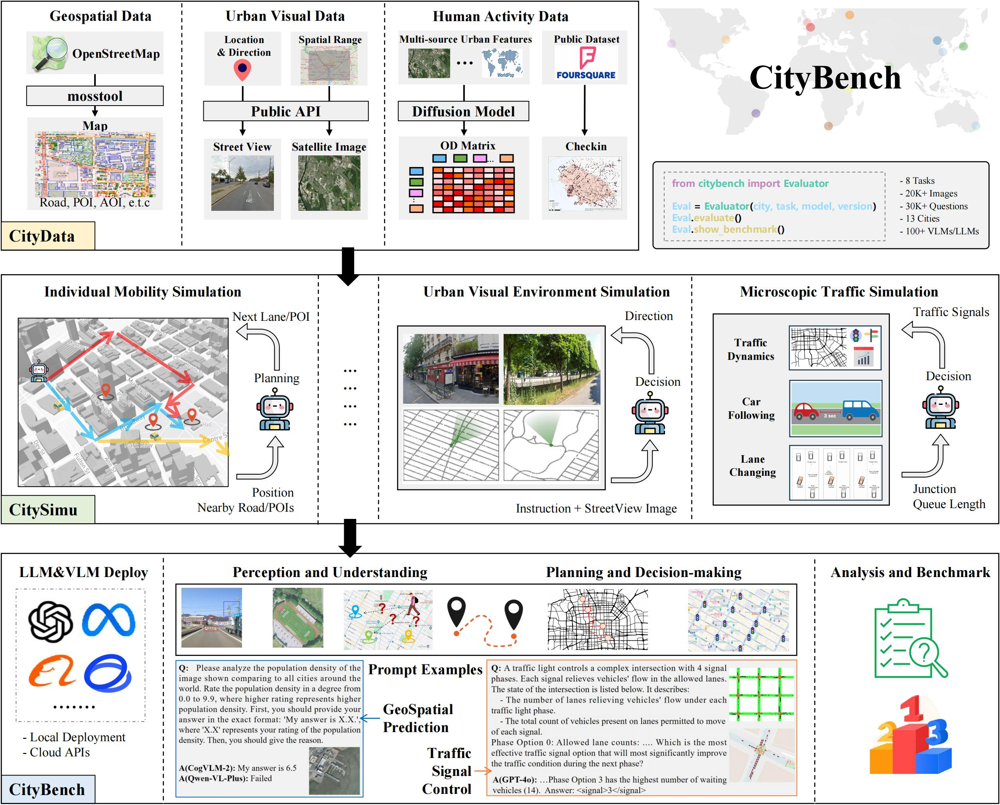

# CityBench

This repo is for CityBench: Evaluating the Capabilities of Large Language Model for Urban Tasks

## 📢 News

🎉: (2025.05) CityBench has been accepted to **KDD 2025 D&B Track**.

## Introduction

TL;DR: We propose a simulator based global scale benchmark to evaluate the performance of large language models on various urban tasks.

In this paper, we design ***CityBench***, an interactive simulator based evaluation platform, as the first systematic benchmark for evaluating the capabilities of LLMs for diverse tasks in urban research. First, we build ***CityData*** to integrate the diverse urban data and ***CitySimu*** to simulate fine-grained urban dynamics. Based on CityData and CitySimu, we design 8 representative urban tasks in 2 categories of perception-understanding and decision-making as the CityBench. With extensive results from 30 well-known LLMs and VLMs in 13 cities around the world, we find that advanced LLMs and VLMs can achieve competitive performance in diverse urban tasks requiring commonsense and semantic understanding abilities.

## 🌍 Framework

The framework of global evaluation benchmark CityBench, which consists of a simulator CitySimu and 8 representative urban tasks. We can select any city around the world to automatically build new benchmark for it.


### 🌆 Supported Cities

Currently, the following cities are supported.


| World    | Cities       |     Visual Data     |                            | GeoSpatial Data |          | Human Activity Data |          |
| :------- | :----------- | :-----------------: | :------------------------: | :-------------: | :------: | :-----------------: | :------: |
|          |              | Satellite<br> Image | Street View<br> (sampling) |      Roads      | PoI/AoIs |  OD flow<br> (10)  | Checkins |
| Asia     | Beijing      |        1764        |            7482            |      17043      |  276090  |       1905025       |  21015  |
|          | Shanghai     |        5925        |            4170            |      33321      |  57731  |       845188       |  33129  |
|          | Mumbai       |         638         |            6025            |      6296      |  60245  |       309147       |  31521  |
|          | Tokyo        |        1120        |            5514            |      33174      | 1146094 |       969865       | 1044809 |
| Europe   | London       |        1710        |            4148            |      14418      |  83892  |       1401404       |  173268  |
|          | Paris        |         238         |            6044            |      4443      |  21950  |        28362        |  85679  |
|          | Moscow       |        1558        |            5761            |      9850      |  28289  |       979064       |  836313  |
| Americas | NewYork      |         320         |            3934            |      5414      |  349348  |        71705        |  390934  |
|          | SanFrancisco |         345         |            4473            |      4171      |  73777  |        61367        |  100249  |
|          | SaoPaulo     |        1332        |            5184            |      28714      | 1681735 |       311830       |  808754  |
| Africa   | Nairobi      |         336         |            5987            |      2972      |  264101  |       135332       |  25727  |
|          | CapeTown     |         896         |            5175            |      5947      |  151711  |       525578       |  11591  |
| Oceania  | Sydney       |        1935        |            5087            |      21390      |  141997  |       438763       |  54170  |

<!-- ### Custom Map
we can custom new map by using tools from [mosstools](https://github.com/tsinghua-fib-lab/mosstool)
```bash
python build_map.py
python map_osm2geojson.py
``` -->

## ⌨️ Codes Structure

- citybench     # evaluation codes
- citysim       # codes for running simulation
- citydata      # data used for evaluation
- serving       # codes for deploy LLM and MLLM
- results       # records of evaluation results
- config.py     # global variables in project
- evaluate.py   # main evaluation function

## 🔧 Installation

Install Python dependencies.

```bash
conda create -n citybench python==3.10
pip install -r requirements.txt
```

## 🤖 LLM and VLM Support

For using LLM/VLM API, you need to set API Key as follows

```
export OpenAI_API_KEY = ""         # For OpenAI GPT3.5, GPT4, GPT4o
export DASHSCOPE_API_KEY = ""       # For QwenVL
export DeepInfra_API_KEY = ""        # For LLama3, Gemma, Mistral
export SiliconFlow_API_KEY = ""        # For InternLM or Qwen
```

Besides, we use [vllm](https://github.com/vllm-project/vllm) for local LLM deployment and [VLMEvalKit](https://github.com/open-compass/VLMEvalKit) for VLM deployment.

## Stage1: Evaluation Data Preparation

### Existing Dataset of 13 Cities

We provide the CityData dataset for the existing 13 cities respectively. To access the dataset, please refer to [CityData-huggingface](https://huggingface.co/datasets/Tianhui-Liu/CityBench-CityData).

### Building a New City Dataset

If you want to construct a dataset for new cities, please follow the instruction below:

Please first navigate to the `CityBench` directory by using the cd command: `cd CityBench`

#### New City Map

We provide a script for generating maps related to new cities in CitySimu. You need to first define the latitude and longitude range for a city's area, and then run the following command.

```bash
python -m citysim.build_map --city_name=Paris --min_lon=2.249 --max_lon=2.4239 --min_lat=48.8115 --max_lat=48.9038 --workers=20
```

There are some parameters that need to be explained:

* `min_lon`, `max_lon`, `min_lat`, and `max_lat` refer to the latitude and longitude range of a specific city area you have defined. Additionally, the latitude and longitude ranges for the 13 existing cities can be found in `config.py`.
* `workers` refers to the number of workers for multiprocessing.

When the corresponding map for a new city has been generated, please update the relevant parameter settings in `config.py`.

#### Download Street View Images

The tasks Geolocalization and Outdoor Navigation both require street images, and their downloading methods are the same. Please refer to the following instructions.

First, generate points of latitude and longitude in the city you want to obtain street view images.

```bash
# For task Geolocalization
python -m citybench.street_view.Randompoints_Gen
# For task Outdoor Navigation
python -m citybench.outdoor_navigation.sample_points_gen
```

Then, scrape street view images. Since the method for downloading street view images is the same, here we take Outdoor Navigation as an example. If you want to download images for the Geolocalization task, you only need to change the paths for saving the images and results.

For Chinese cities such as Beijing and Shanghai, street view images need to be obtained through Baidu. For other cities, they can be obtained through Google. Please first set the Baidu/Google API Key, and then run the script below.

```bash
# Set Baidu API key
export BAIDU_KEY = ""
# Scrape images through Baidu
python -m citybench.outdoor_navigation.crawler_baidu --city_name=SanFrancisco

# Set Google API key
export GOOGLE_API_KEY = ""
# Scrape images through Google
python -m citybench.outdoor_navigation.crawler_google --city_name=SanFrancisco --multi_process_num=20 --index=0 --total_points=50
# Stitch Google images 
python -m citybench.outdoor_navigation.stitch_image_patches --city_name=SanFrancisco --multi_process_num=20 --image_size=512 --out_image_size_width=512 --out_image_size_height=512
```

Here are some new parameters to introduce:

* `multi_process_num`: Refers to the number of threads for multiprocessing. Ensure that it does not exceed the number of CPU cores to avoid overloading the system.
* `index`: Indicates the starting group index for downloading. The script will begin processing from the specified group.
* `total_points`: Specifies the number of points to download within each group. This determines the total number of locations to process for every group.
* `IMG_SIZE`: The dimensions (width/height) of the originally downloaded images.
* `OUT_IMG_SIZE_W`: The width of the final output panoramic image.
* `OUT_IMG_SIZE_H`: The height of the final output panoramic image.

It's necessary to generate URLs for all street view images required for the Outdoor Navigation task. Place a file named `url_mapping.csv` in the location `citydata/outdoor_navigation_tasks/NEW_StreetView_Images_CUT/`, containing two columns: `image_name` and `image_url`.

#### Download Satellite Images

You can refer to the `citybench/remote_sensing/download_rs_img.py` script to download satellite images. Please add the information of the city you want to download into the script first, and then run the following command.

```bash
python -m citybench.remote_sensing.download_rs_img --city_name=Beijing
```

#### Prepare Data for CityData

We provide the scripts to generate the evaluation dataset for each task. The following command needs to be executed to generate the evaluation dataset. You can obtain the dataset as the following examples:

```bash
# For task GeoQA, Mobility Prediction, Outdoor Navigation, Traffic Signal
python -m citybench.geoqa.data_gen --city_name=Tokyo
# For task Urban Exploration
python -m citybench.urban_exploration.eval --city_name=Tokyo --model_name=LLama3-8B --mode=gen
# For task Poplulation and Objects
python -m citybench.remote_sensing.prepare_image_and_pop --city_name=Tokyo
# For task Geolocalization
python -m citybench.street_view.Build_StreetView_List --city_name=Tokyo
```

Once the above command is executed, you can find the generated evaluation dataset in the `citydata` folder.

## Stage2: Running Single Evaluation

Supported models, tasks, cities can refer to config.py. The following is an example evaluation for a specific task, model, and city.

```bash
python -m citybench.traffic_signal.run_eval --city_name=London --model_name=LLama3-8B --data_name=mini
```

`data_name` refers to the size of the evaluation dataset, where 'mini' generally represents 10% of the data used in 'all'. After the evaluation code finishes running, you can find the model's response records and metrics in the corresponding folder under`results`. For further metric statistics, please refer to the next step.

## Stage3: Summarizing Metrics

We have prepared a `metrics.py` file for each task to calculate the models' results on urban tasks in different cities. You can statistical the model results of one task by following the below example.

```
python -m citybench.mobility_prediction.metrics
```

The summary results file will appear in the results folder of the corresponding task, e.g., `results/prediction_results/mobility_benchmark_result.csv`

## Running Evaluation

Evaluate multiple models, tasks, and cities, and output the statistical results.

```bash
# The unified portal directly evaluates all tasks
python -m evalaute --model_name=GPT4o,MiniCPM-Llama3-V-2_5 --task_name=geoqa,mobility --city_name=NewYork,Paris,Beijing --data_name=mini
```

## 🌟 Citation

If you find this work helpful, please cite our paper.

```latex
@article{Feng2025CityBench,
  title={CityBench: Evaluating the Capabilities of Large Language Models for Urban Tasks},
  author={Jie Feng, Jun Zhang, Tianhui Liu, Xin Zhang, Tianjian Ouyang, Junbo Yan, Yuwei Du, Siqi Guo, Yong Li},
  booktitle = {Proceedings of the 31th ACM SIGKDD International Conference on Knowledge Discovery and Data Mining},
  year = {2025}
}
```

## 👏 Acknowledgement

We appreciate the following GitHub repos a lot for their valuable code and efforts.

- https://github.com/xlwang233/LLM-Mob for mobility prediction
- https://github.com/usail-hkust/LLMTSCS for traffic signal control
- https://github.com/THUDM/AgentTuning for multi-choice evaluation

## 📩 Contact

If you have any questions or want to use the code, feel free to contact:
Jie Feng (fengjie@tsinghua.edu.cn)
