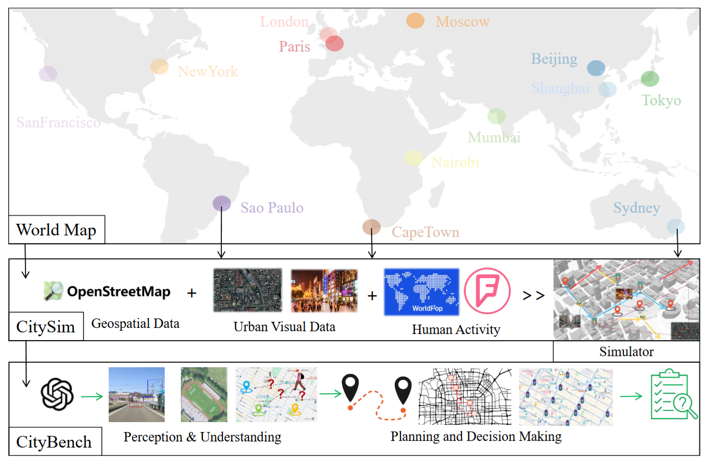

# CityBench
This repo is for CityBench: Evaluating the Capabilities of Large Language Model as World Model
## Introduction
Large language models (LLMs) with powerful generalization ability has been widely used in many domains. A systematic and reliable evaluation of LLMs is a crucial step in their development and applications, especially for specific professional fields. In the urban domain, there have been some early explorations about the usability of LLMs, but a systematic and scalable evaluation benchmark is still lacking. The challenge in constructing a systematic evaluation benchmark for the urban domain lies in the diversity of data and scenarios, as well as the complex and dynamic nature of cities. In this paper, we propose CityBench, an interactive simulator based evaluation platform, as the first systematic evaluation benchmark for the capability of LLMs for urban domain. First, we build CitySim to integrate the multi-source data and simulate fine-grained urban dynamics. Based on CitySim, we design 7 tasks in 2 categories of perception-understanding and decision-making group to evaluate the capability of LLMs as city-scale world model in urban domain.

## Overall Structure
The framework of global evaluation benchmark CityBench, which consists of a simulator CitySim and 7 representative urban tasks. We can select any city around the world to automatically
build new benchmark for it.


## Installation
```bash
conda create -n citybench python==3.10
pip install -r requirements.txt
```

## Supported Cities
Currently, the following cities are supported. The dictionary below records the city names and their corresponding map names. The default cache location for map is `data/map_cache/`
```json
{
    "shanghai": "map_shanghai_20240525",
    "beijing": "map_beijing5ring_withpoi_0424",
    "mumbai": "map_mumbai_20240525",
    "tokyo": "map_tokyo_20240526",
    "london": "map_london_20240526",
    "paris": "map_paris_20240512",
    "moscow": "map_moscow_20240526",
    "newyork": "map_newyork_20240512",
    "san_francisco": "map_san_francisco_20240526",
    "sao_paulo": "map_san_paulo_20240530",
    "nairobi": "map_nairobi_20240529",
    "cape_town": "map_cape_town_20240529",
    "sydney": "map_sydney_20240529"
}
```
Processed map data can be downloaded from [citybench-map](https://cloud.tsinghua.edu.cn/d/ac110614e28544dab8db/)

### Custom Map
we can custom new map by using tools from [mosstools](https://github.com/tsinghua-fib-lab/mosstool)
```bash
python build_map.py
python map_osm2geojson.py
```

## LLM Model Support
Evaluation is supported via OpenAI API, while models like LLaMA3 and Mistral use DeepInfra. You need to set you APIKey before running the following codes
```
# if you can not directly OpenAI, you need to set proxy like below
PROXY = "http://127.0.0.1:10190"

# your APIKEY
OPENAI_APIKEY = ""          # For GPT3.5,GPT4
DEEPINFRA_APIKEY = ""       # For LLama3 or Mistral
DEEPSEEK_APIKEY = ""        # For Deepseek

MONGODB_URI = ""
```

## Perception Task - GeoSpatial
### Data Preparation(optional)
Generate evaluation data for a city, which is saved in the `task_Geo_knowledge` directory, excluding version v82.
```bash
cd perception/geo
python evaluate_geoqa_gen.py --city=shanghai --evaluate_version=v83
python evaluate_image_gen.py --city=shanghai --evaluate_version=v83
```
The `task_Geo_knowledge.tar.gz` contains pre-generated evaluation data, ready for use after extraction.

### Running Evaluation
Test the performance of a model on shanghai as an example:
```bash
cd perception/geo
python run_eval.py \
    --model_name "meta-llama/Meta-Llama-3-8B-Instruct" \
    --city_eval_version v82 \
    --city shanghai \
```
After testing multiple models across various cities, summarize the evaluation results:
```bash
cd perception/geo
python analyse_result.py
```

## Perception Task - Visual
### Data Preparation(required)
Due to the limitation of Google Maps Platform license, the Baidu Maps Platform license and the Esri Master License Agreement. We can not provide the visual data directly. We cannot provide the origin data. Users need to obtain the data from the public API

### Running Evaluation
Refer to [remote sensing for geospatial prediction and infrastructure inference](./perception/visual/remote_sensing/README.md) and [street-view for image geolocalization](./perception/visual/street_view/README.md)

## Decision Task - Mobility Prediction
### Data Preparation（optional)
Download [foursquare check-in data](https://drive.google.com/file/d/0BwrgZ-IdrTotZ0U0ZER2ejI3VVk/view?resourcekey=0-rlHp_JcRyFAxN7v5OAGldw) and run the preprocessing code. Here, we assume the downloaded data is in the `decision/prediction/origin_data` directory.
```bash
cd decision/prediction
python data_process.py \
    --input_path ./origin_data \
    --filter_path ./checkin \
    --output_path ./checkin_split \
    --final_output ./checkin_test_pk \
    --repeat_THR 0.05 \
    --context_step 40 \
    --historical_step 5 \
    --step 1
```
The processed data is located in the `checkin_split` and `checkin_test_pk`. Extract the files to use them.
### Running Evaluation
Execute trajectory prediction tasks for a single model and city:
```bash
python llm_mob.py \
    --city shanghai \
    --model "meta-llama/Meta-Llama-3-8B-Instruct" \
    --user_cnt 50 \
    --sample_single_user 10 \
    --num_historical_stay 40 \
    --num_context_stay 5 \
    --split_path "./checkin_split/" \
    --test_path "./checkin_test_pk/"
```
Parallel prediction for multiple cities and models. Manually modify city and model names to select the models and cities for parallel evaluation. Parameters are the same as llm_mob.py。
```bash
python run_parallel.py \
    --user_cnt 50 \
    --traj_cnt 10
```

## Decision Task - Navigation
### Data Preparation(required)
Generate evaluation data for a city, which is saved in the `results` directory. You need to download map data from [citybench-map](https://cloud.tsinghua.edu.cn/d/ac110614e28544dab8db/).
```bash
cd decision/navigation
python eval.py --city=shanghai --model="meta-llama/Meta-Llama-3-70B-Instruct" --mode=gen --samples=50
```
Pre-generated city data is saved in the `results` directory and can be used directly.

### Running Evaluation
Test the performance of a model on a specific city:
```bash
cd decision/navigation
python eval.py --city=shanghai --model="meta-llama/Meta-Llama-3-8B-Instruct" --mode=eval
```

## Decision Task - Traffic Signal Control
### Data Preparation(optional)
Download traffic flow data and run preprocessing. The processed data is saved in the `EXP_ORIG_DATA` and `trips` directories.
```bash
cd decision/traffic_signal
python process_data.py --city=shanghai --mode=map_transfer
python process_data.py --city=shanghai --mode=gen_trips
python process_data.py --city=shanghai --mode=filter_trips
```
The `EXP_ORIG_DATA` data is large and needs to be downloaded from [citybench-map](https://cloud.tsinghua.edu.cn/d/ac110614e28544dab8db/), then extracted to the `decision/traffic_signal/EXP_ORIG_DATA` directory.

### Running Evaluation
Test the performance of a single model on a specific city. The results are stored in the `results` directory.
```bash
cd decision/traffic_signal
python traffic_control.py --city=shanghai --model="meta-llama/Meta-Llama-3-8B-Instruct" --total_time=3600 #seconds
```

## Acknowledgement
We appreciate the following GitHub repos a lot for their valuable code and efforts.
- https://github.com/xlwang233/LLM-Mob for mobility prediction
- https://github.com/usail-hkust/LLMTSCS for traffic signal control
- https://github.com/THUDM/AgentTuning for multi-choice evaluation

## Contact
If you have any questions or want to use the code, feel free to contact:
Jie Feng (fengjie@tsinghua.edu.cn)